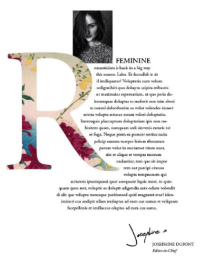

# Moodboard

## Inspirations

### Noir, blanc et sobre

Travail intéressant sur la police et le rythme vertical. Grosse police a empattement (côté humain) et la photo inclinée donne un gros mouvement à la page. Crée du mouvement sans animation. Site séparé en différentes catégories pas assez claires à mon gout, ça manque de texte mais les titres sortent de la grille et ça donne du dynamisme. Au niveau des couleurs c'est sympa, les nuances de gris et de blanc sont cool. Pauvre en couleur mais riche en contraste. Ensemble cohérant.

https://www.behance.net/gallery/108115427/Website-Portfolio-Design-UXUI?tracking_source=search_projects_recommended%7Cportfolio%20ux

### Ensemble de couleurs et illustrations

Le menu est sympa, la photo avec le pull jaune s'accorde avec la palette du site c'est super malin. La palette est bien pensée, du blanc, du gris et du jaune sous plusieurs nuances. Couleurs neutres et le jaune donne un coup de peps à l'ensemble. La police de titrange est cool mais je n'aime pas ses "m". Boutons avec deux couleurs sont cool mais manque de contraste sur le jaune.

https://www.behance.net/gallery/96275519/Nimbus-CV-Portfolio-WordPress-Theme?tracking_source=search_projects_recommended%7Cportfolio%20ux

### Calme et illustré

Les animations attirent l'oeil directement. Le travail sur les polices est intéressant et le rythme vertical me plait beaucoup, donne un sentiment de calme. Les images à côté du texte illustre bien. La fin du site dit "à votre tour" et propose deux actions, ça insite bien à contacter parce que ça se fait après la lecture. ce'st comme une petite histoir en fait.

https://www.behance.net/gallery/63065537/My-Portfolio-Website?tracking_source=search_projects_recommended%7Cportfolio%20ux

## Idée livre stylisé

Page d'acceuil ne sera pas un livre mais la partie portfolio bien. Ou bien je joue le jeu à fond.

### Industrial design

Ressemble à une sorte de catalogue. Grille super efficace, rythme vertical bien géré et treès grandes images. Grille très propre. Avec un menu, page en vis à vis ou bien un scroll "magnétique" ça peut etre cool. Point négatif: ça ressemble un manuel d'une célèbre marque suédoise.

https://www.behance.net/gallery/103157723/Industrial-Design-Portfolio-2020?tracking_source=search_projects_recommended%7Cportfolio

### Petite landing page

Idée du livre, on ne voit plus l'objet mais on le reconnait. Un peu trop chargé en image à mon goût mais ça donne une petite idée.

https://dribbble.com/shots/9891345-Freshink-magazine

## Elements

### Lettrines

Pour rappeller l'aspect livre.

